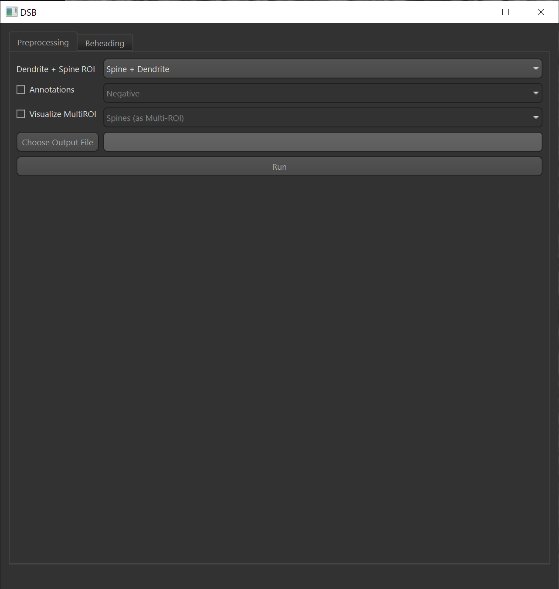
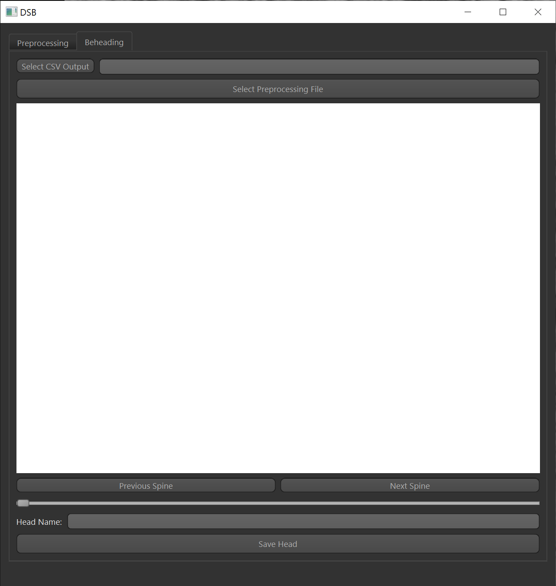
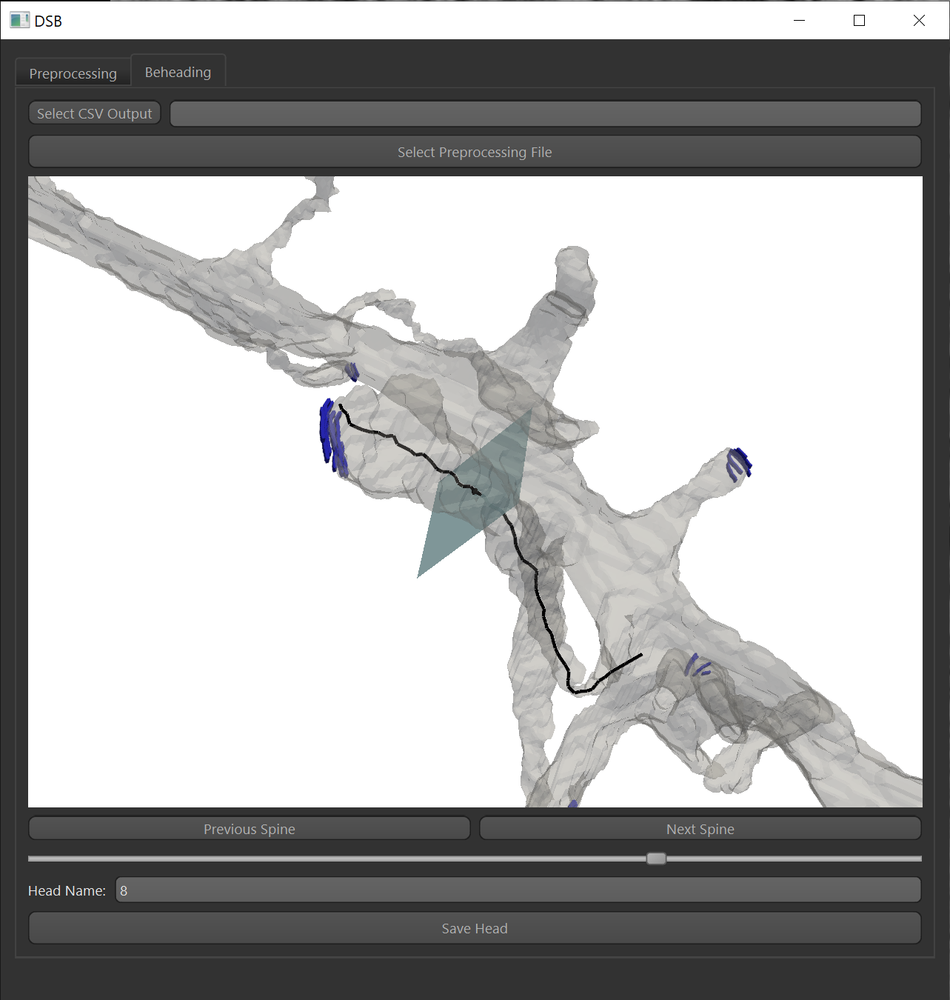
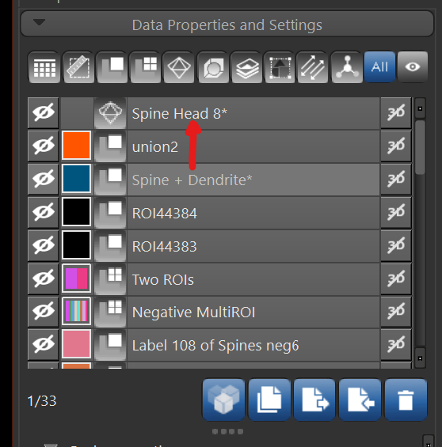

# User Guide

This document explains how to use the DSB plugin in Dragonfly. If you have not already, please read the installation instructions and install the plugin.

## Overview

The workflow for this plugin is split into two general steps: preprocessing and beheading. In the DSB user interface, this is denoted by two tabs with the same name. Preprocessing puts the raw data into an intermediate format that can be easily worked with by the plugin. Once preprocessing is finished, the preprocessing data can be loaded to start the beheading step, where a researcher overviews the suggested beheading point and slice direction given by an automatic algorithm, and optionally adjusts the beheading location.

## Preprocessing

The preprocessing step collects the raw data and organizes in a way that is quick and efficient to process. To access the preprocessing page, select the **Preprocessing** tab on the top of the DSB window.

You may provide:

* **(Required)** An ROI (voxel segmentation) of the dendrite and dendritic spines *combined*. Note you may need to union the dendrite ROI and spines ROI if they are separate.
* **(Optional)** Annotations to display in the beheading step. It also allows DSB to infer the dendrite names when exporting the spine heads (in the beheading step).
* **(Optional)** A MultiROI to visualize alongside the dendrite mesh. Useful for visualizing postsynaptic densities (PSDs) to help one better understand where the synapse is.

> ✅ **Tip:** Click the checkbox next to the optional items to enable them, then you may select the annotation/MultiROI.

In addition, you must specify an output file (with a `.dsb` file extension). This file will be loaded in the **Beheading** step so that preprocessing does not need to be performed every time DSB is run. The filesize depends on the dataset size, but is generally a couple hundred megabytes.

Once you specify the dendrite + spines and optionally annotations or MultiROI, click the **Run** button. The preprocessing time depends on the size of the dataset, but is generally 10-20 minutes. Once the **Run** button is pressed, minimal human intervention is required. Text on the bottom of the DSB window will display when the preprocessing step is complete.

> ⚠️ **Warning:** Once preprocessing starts, there may not be a way to cancel it without closing the Dragonfly application. Be sure that your parameters are correct before running the preprocessing stage.

## Beheading

To access the beheading page, click the **Beheading** tab on the top of the DSB window.

### Selecting an Output CSV File

**Optional Step:** When beheading, it may be helpful to have the spine head ID, spine head name, and spine head volume in one CSV. You may choose an output CSV file location by clicking the **Select CSV Output** button. Any spines beheaded will appear in the CSV.

> ✅ **Tip:** You may append to a CSV by selecting an already-existing one. This is useful for making modifications, proofreading, collaborating, etc. *You may get a overwrite warning when selecting the existing CSV, but it can be safely ignored*.

### Loading a Preprocessing File

Loading a preprocessing file is simple: click **Select Preprocessing File** and choose the `.dsb` file to load.

After the preprocessing file is selected, you should see the visualization window populate.

> 🐞 **Known Issue:** The visualization window may look incorrectly scaled immediately after loading data, which can be fixed by resizing the DSB window by at least 1 pixel. If the visualization window is completely black, restart DSB and start the beheading instructions again.

### Actually Beheading!

Once the preprocessing file populates, you will (hopefully) notice a line going through a dendritic spine. This is called the *skeleton*. You may also notice a plane with a point in the middle. The point shows the *beheading point* and the plane displays the *cut direction*. DSB automatically creates a suggestion for the cut direction and beheading point.

> ℹ️ **Info:** Sometimes DSB displays a skeleton that is not a part of a dendrite. If this is the case, simply click **Next Spine** until an appropriate spine head is displayed.

If you disagree with the output of DSB, you may adjust the slider under the visualization window, which changes the beheading point. The cut direction is computed automatically from the spine skeleton.

Once complete, verify the spine head name is correct by checking the **Head Name** field near the bottom. 

> ✅ **Tip:** If you selected an annotation in the preprocessing step, the dendritic spine head name will be the name of the closest annotation.

Finally, click the **Save Head** button. A mesh is then output in Dragonfly and, if a CSV is specified, a new row in the CSV.

> ⚠️ **Warning:** Ensure that the CSV not open in Excel, Notepad, etc. since that will interfere with DSB writing to the file.

