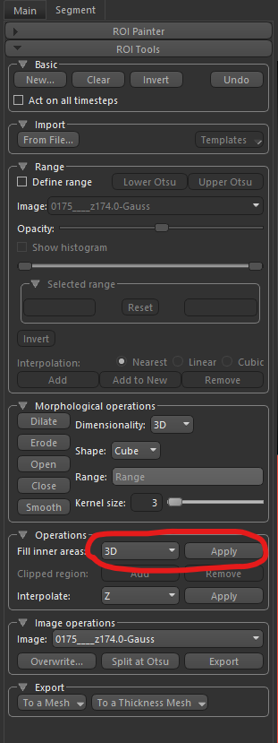
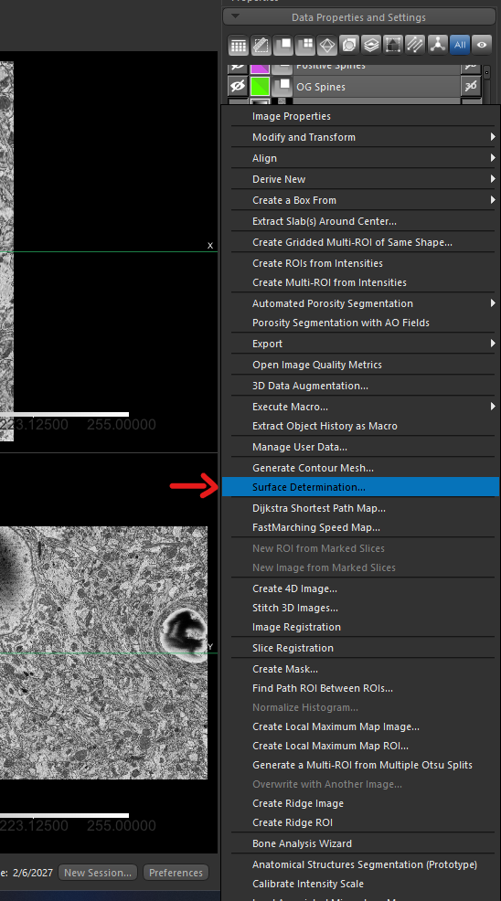
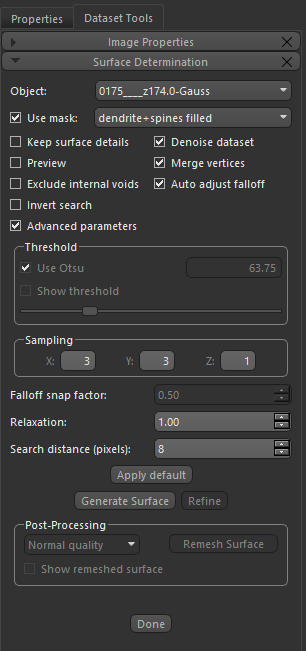
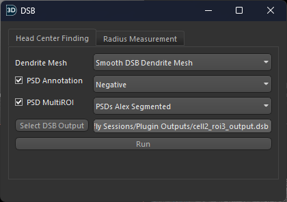
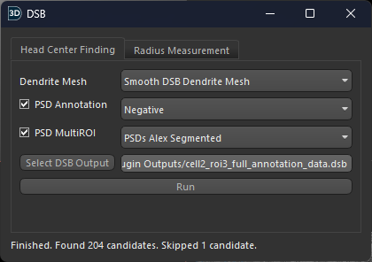

# User Guide

This document explains how to use the DSB plugin in Dragonfly. If you have not already, please [install the plugin](INSTALLATION.md).

At the end of this guide, you will have a .dsb file that the DSB proofreader program can read.

## Converting Voxel to Mesh

DSB processes a dendrite mesh, but many EM workflows only have voxel segmentations of a dendrite. This section will guide you through making a mesh that is suitable for DSB processing.

If you haven't already, create a Dragonfly ROI that contains the dendrite and dendritic spines. This will be called the "dendrite ROI."

Then, fill any areas in the dendrite ROI using Dragonfly's ROI tools window.

> ℹ️ **Info:** This is an important step to remove any inner voids in the resulting mesh, which may cause skeletonization to produce an incorrect result.

Next, right-click on the base EM image and click "Surface determination." Dragonfly may freeze for several minutes while it opens the surface determination window.

Then, use the following parameters. It's very important to set your dendrite ROI as the mask. Otherwise, surface determination will mesh the entire dataset.

Once the parameters are set, click "Generate Surface" to generate a mesh of the dendrite. This step may take several hours.

## Processing

The final step is to use the DSB plugin to make the .dsb file that the proofreader will use.

DSB asks for the following items:

* **(Required)** A Dragonfly Mesh of the dendrite, created in the previous step.
* **(Required)** A save location for the .dsb file.
* **(Optional, strongly recommended)** A Dragonfly Annotations to display in the proofreader. It also allows DSB to infer the spine head names.
* **(Optional, strongly recommended)** A Dragonfly MultiROI to visualize alongside the dendrite mesh. Useful for visualizing postsynaptic densities (PSDs) to help one better understand where the synapse is. Also helps with spine head name inference.

> ✅ **Tip:** Click the checkbox next to the optional items to enable them, then you may select the annotation/MultiROI.

Once you configure DSB, click the **Run** button. Processing time depends on the size of the dataset, but it generally takes 10–20 minutes. Text on the bottom of the DSB window will display the status.

> ⚠️ **Warning:** Once preprocessing starts, there may not be a way to cancel it without closing the Dragonfly application. Be sure that your parameters are correct before running the preprocessing stage.

When processing is finished, you will see a status message like this:

"Skipped 1 candidate" means that there was an error with DSB while computing the spine head center for one candidate, and the datapoint will not be included in the .dsb file. 

You may check the Dragonfly logs for more information on the exact error message thrown.

## Conclusion

You now have a .dsb file that the proofreader can read.
